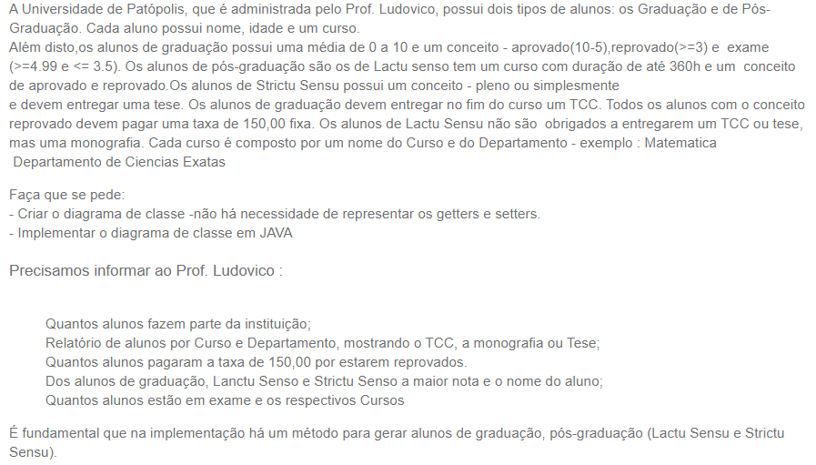

# Universidade de Patópolis - Sistema de Gestão de Alunos

## Descrição
Este sistema gerencia informações sobre os alunos da Universidade de Patópolis, incluindo detalhes sobre os cursos, conceitos de aprovação, entrega de trabalhos acadêmicos e taxas de reprovação.

## Funcionalidades
- Cadastro de alunos de graduação e pós-graduação (Lactu Sensu e Strictu Sensu).
- Registro de notas e conceitos dos alunos.
- Acompanhamento da entrega de trabalhos acadêmicos (TCC, monografia, tese).
- Cálculo e cobrança de taxas de reprovação.
- Geração de relatórios estatísticos sobre os alunos.

## Relatórios Disponíveis
- Quantidade total de alunos na instituição.
- Relatório de alunos por curso e departamento, incluindo detalhes sobre os trabalhos acadêmicos entregues.
- Número de alunos que pagaram a taxa de reprovação.
- Maior nota e nome do aluno em cada categoria (graduação, Lactu Sensu, Strictu Sensu).
- Número de alunos em exame, categorizados por curso.

